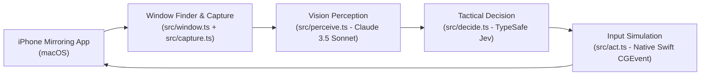

# Jev Plays Clash Royale 👑

An autonomous proof-of-concept agent that plays **Clash Royale** on macOS through the native **iPhone Mirroring** app, deciding tactical plays using [TypeSafe](https://typesafe.ai)'s **Jev** ("System One") decision model.

---

## Architecture



1. **Locate Window** (`src/window.ts`): Queries `CGWindowListCopyWindowInfo` to locate the iPhone Mirroring app window and retrieve its on-screen pixel coordinates and window ID.
2. **Capture** (`src/capture.ts`): Uses macOS native `screencapture -x -o -l<windowID>` to take silent, shadow-free screenshots of only the iPhone Mirroring window.
3. **Perceive** (`src/perceive.ts`): Passes the screenshot to a vision model (Claude 3.5 Sonnet) to extract elixir count, cards in hand, troop placements, tower HP, and match phase as structured JSON.
4. **Decide** (`src/decide.ts`): Sends the structured game state to TypeSafe's Jev model via `@typesafe-ai/sdk` using a single batched `systemOne` request (`shouldPlayNow` Noul, `whichCard` Choice, and `whichLane` Choice).
5. **Act** (`src/act.ts`): Translates the chosen card slot and placement into screen coordinates and simulates taps via a compiled native Swift `CGEvent` helper (`bin/helper`).
6. **Loop** (`src/loop.ts`): Continuously executes the pipeline every 1–3 seconds while a battle is in progress, automatically stopping when the match ends or on `Ctrl+C`.

---

## Setup & Prerequisites

### 1. Requirements
- macOS 15 (Sequoia)+ with iPhone Mirroring
- Node.js v20+ (v22 installed)
- macOS Accessibility Permissions granted to your terminal application (System Settings → Privacy & Security → Accessibility) so synthetic mouse events can be dispatched.

### 2. Environment Variables
Your `.env` file is already configured with your TypeSafe API key:

```env
TYPESAFE_API_KEY=apikey_210920cf180c154b49aeb7e28af5c8cb4083_...
ANTHROPIC_API_KEY=your_anthropic_api_key_here
VISION_MODEL=claude-3-5-sonnet-20241022
TICK_INTERVAL_MS=2000
CLICK_TOOL=native
```

> **Note**: An Anthropic API key is required in `ANTHROPIC_API_KEY` for the vision perception step.

---

## Usage

### Test Tactical Decisions (TypeSafe Jev)
Run the automated test suite to verify TypeSafe Jev integration, card decision logic, and screen coordinate mapping:
```bash
npm test
```

### Inspect Visible Windows
Verify that macOS detects your open windows:
```bash
npm run list-windows
```

### Test Window Capture
Capture a single test frame of the iPhone Mirroring window without running models:
```bash
npm run capture-test
```

### Dry Run (Safe Test Mode)
Run the full loop (window capture, Claude vision perception, and TypeSafe Jev decisions) without sending clicks:
```bash
npm run dry-run
```

### Run Autonomous Agent
Once iPhone Mirroring is open with Clash Royale loaded into a match:
```bash
npm start
```
To stop the agent at any time, press `Ctrl+C`.

---

## Project Structure

```
jevgames/
├── native/
│   └── helper.swift       # Swift helper for CGWindowList and CGEvent clicks
├── bin/
│   └── helper             # Compiled native macOS helper binary
├── src/
│   ├── index.ts           # CLI entrypoint with diagnostic flags
│   ├── window.ts          # Window detection and bounds resolution
│   ├── capture.ts         # High-resolution silent window screenshot capture
│   ├── perceive.ts        # Claude vision perception and JSON extraction
│   ├── decide.ts          # TypeSafe Jev batched System One decision
│   ├── act.ts             # Screen coordinate mapping and tap sequence execution
│   ├── loop.ts            # Main tick loop and match lifecycle management
│   └── types.ts           # TypeScript interfaces for game state & decisions
├── test/
│   ├── test_decide.ts     # Defense scenario test with live Jev model
│   ├── test_offense.ts    # Offense scenario test with live Jev model
│   └── test_act.ts        # Action coordinate calculation test
├── .env                   # API keys and runtime configuration
├── package.json
└── SPEC.md                # Project design specification
```
