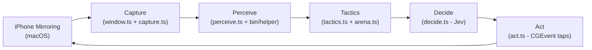

# Jev Plays Clash Royale 👑

An autonomous agent that plays **Clash Royale** on macOS through the native
**iPhone Mirroring** app. Perception is entirely local and deterministic;
[TypeSafe](https://typesafe.ai)'s **Jev** ("System One") model is used to
arbitrate between tactical options that have already been validated in code.

---

## Architecture



1. **Locate & capture** — finds the iPhone Mirroring window via
   `CGWindowListCopyWindowInfo` and grabs silent, shadow-free frames with
   `screencapture -x -o -l<windowID>`.
2. **Perceive** (`src/perceive.ts` + `native/helper.swift`) — one native pass
   per frame extracts everything from pixels:
   - **Cards in hand**, by normalized cross-correlation against the official
     card art for all 120 cards (`assets/card-index.json`).
   - **Elixir**, by measuring how far the magenta fill extends along the bar,
     which yields a *fractional* value (e.g. `7.15`) rather than an OCR'd digit.
   - **Enemy and friendly units**, from the red/blue health bars Clash Royale
     draws above them — this is the only on-screen signal for unit ownership.
   - **Clock, double elixir and tower hit points**, via Apple Vision OCR, run on
     a schedule rather than every frame.
3. **Tactics** (`src/tactics.ts`, `src/arena.ts`) — generates concrete candidate
   plays (a specific card at a specific point), scored by Clash Royale rules:
   defend before pushing, win the elixir trade, never leak at the cap, aim
   spells at clusters, prefer defenders that can hit air.
4. **Decide** (`src/decide.ts`) — urgent situations are played immediately from
   local tactics. Otherwise Jev picks between the generated candidates.
5. **Act** (`src/act.ts`) — taps the card, then taps the placement, through a
   native Swift `CGEvent` helper.

### Why perception is local

Cloud vision was measured and rejected, not assumed away:

| Approach | Latency | Result |
|---|---|---|
| `claude -p` CLI (Haiku, subscription) | **22.5s / frame** | Hallucinated the hand — returned "Lumberjack, Spear Goblins, Barbarian, Ogre" for a hand that was Mini P.E.K.K.A, Baby Dragon, Knight, Goblin Barrel |
| Template matching (this repo) | **~10ms** | Correct on every battle frame tested |

Card art on screen is roughly 70×90 pixels, which is below what an LLM can name
reliably. Template matching against the real art is both faster and more
accurate, so there is no vision API key anywhere in this project.

---

## Setup

### Requirements
- macOS 15 (Sequoia)+ with iPhone Mirroring
- Node.js v20+
- Accessibility permission for your terminal
  (System Settings → Privacy & Security → Accessibility), so synthetic taps
  are delivered.

### Install

```bash
npm install
npm run compile-native        # builds bin/helper from native/helper.swift
```

The card index (`assets/card-index.json`) is committed, so it works out of the
box. To rebuild it from source art:

```bash
npm run fetch-card-assets     # downloads ~9MB of card art from RoyaleAPI
npm run build-card-index      # regenerates assets/card-index.json
```

### Configure

Copy `.env.example` to `.env`. A `TYPESAFE_API_KEY` is optional — without it the
agent runs on local tactics alone, which is fully playable.

---

## Running

```bash
npm run dev                   # play, with the live dashboard at localhost:5173
npm run dev:dry               # dashboard + dry run (decides, sends no taps)
npm run list-windows          # confirm iPhone Mirroring is detected
npm run dry-run               # decide and log plays, send no taps
npm start                     # play for real, no dashboard
npm run local                 # play using local tactics only, no model calls
```

### Dashboard

`npm run dev` serves a live view at <http://localhost:5173>. It streams over
Server-Sent Events (no build step, no dependencies) and reconnects on its own if
the agent restarts. It shows:

- **Hand** — each card as recognized from the screen, with the match score and
  margin, so a weak or latched identification is visible rather than silent.
- **Arena** — live unit positions, who owns them, heading arrows for tracked
  units, and a crosshair on the placement that was chosen.
- **Decision** — whether it came from local tactics, an urgent local override,
  or Jev, with the play probability and confidence.
- **Options considered** — every candidate play and its score, chosen one
  highlighted. This is the panel that shows *why* a placement was picked.
- **Elixir**, tower state, and per-stage latency (capture / perceive / decide).

It stays up between matches and shows what it is waiting for, so a blank panel
means the agent is idle rather than broken.

Start it with a match already in progress. It detects the end of a match and
stops; `Ctrl+C` also stops it cleanly.

Useful flags: `--window <query>`, `--interval <ms>`, `--single-tick`.

---

## Known limitations

### The agent cannot tell *which* card the enemy played

This is the biggest gap, and it is a perception limit rather than a bug.

Clash Royale draws a red health bar above an enemy unit, and nothing else that
identifies it. There is no name, no icon, and no card art on screen once a card
has been played. So `ArenaUnit` carries an owner, a position, a velocity and
whether the unit has crossed onto our side — and deliberately nothing more.
The agent knows *that* something is attacking, and from where, but not whether
it is a Skeleton Army or a Golem.

Everything downstream inherits that:

- **No counter-picking.** Tactics score defenders by general properties (can it
  hit air, is it a positive elixir trade) rather than by "Inferno Tower answers
  this". A hard counter and a mediocre one look alike.
- **Ground and air are not distinguished.** Air units get a red bar just like
  ground ones, so the agent prefers defenders that can hit air as a hedge
  instead of knowing it needs to.
- **Threat size is inferred from count and motion, not identity.** Three bars
  moving together read the same whether they are Goblins or Barbarians, so
  spell decisions target clusters rather than the units a spell actually kills.
- **No enemy hand or cycle tracking.** Since played cards are never identified,
  the agent cannot track the opponent's 8-card cycle, predict what is coming,
  or count their elixir. It plays every moment fresh.
- **Health bars are the only unit signal.** Units at full health mid-deploy, or
  ones whose bar is occluded, are simply not seen. Frame differencing adds
  motion intensity to units that already exist; it never invents one.

The honest framing is that this agent reacts to *pressure* — how much is
coming, from which lane, how fast — and not to *matchups*. Closing the gap
needs unit-sprite recognition (template matching against unit art, the way the
hand is already recognized) or a model that can name units at ~40×40 pixels;
neither is in the repo today.

### Other limits

- **OCR-derived state is sampled, not continuous.** Clock, double elixir and
  tower hit points come from Apple Vision OCR on a schedule, so they can lag by
  a few frames.
- **Velocity tracking uses nearest-neighbour matching**, which will occasionally
  swap two units that pass close to each other.
- **iPhone Mirroring only.** Coordinates are calibrated against that window; no
  emulator or real-device path exists.

---

## Tests

```bash
npm test                      # tactics scenarios + perception over real frames
npm run test:tactics          # no network, no screenshots needed
npm run test:perceive         # replays the frames in captures/
```

`test/test_tactics.ts` covers the situations that previously lost games:
ignoring a push, leaking elixir at the cap, spending a spell on a single unit,
and starting a push while under attack. `test/test_perceive.ts` replays the
recorded frames in `captures/` and checks the hand, elixir and phase.

---

## Credits

Card art and card metadata come from RoyaleAPI's open data:
[cr-api-assets](https://github.com/RoyaleAPI/cr-api-assets) and
[cr-api-data](https://github.com/RoyaleAPI/cr-api-data).
